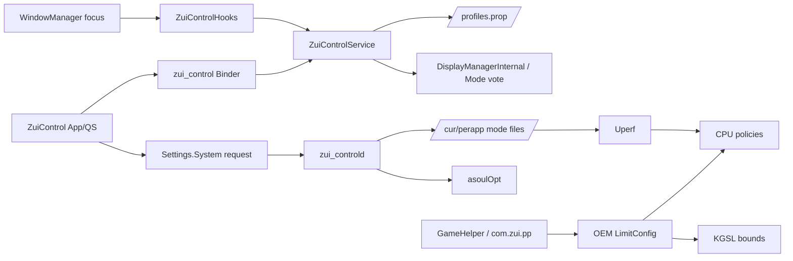

# 架构分析

## 进程模型

| 进程/域 | 组件 | 职责 | 生命周期 |
| --- | --- | --- | --- |
| `system_server` | `ZuiControlService`、`ZuiControlHooks` | 场景识别、profile、刷新率决策、Binder | 随 system_server |
| `com.zui.zuicontrol` | Activity、QS Tile、QuickService | 控制面板、命令发起、通知 | UI/系统按需；QuickService 为 sticky FGS |
| init root service | `zui_controld` | 请求解析、Uperf/asoul 健康检查、状态发布 | init 托管，退出自动重启 |
| init scheduler | `zui_uperf_service` + `/system/bin/uperf` | Uperf supervisor 和核心 | init 托管 |
| init scheduler | `/system/bin/AsoulOpt` | 线程亲和/boost | init 托管单进程 |
| OEM 系统进程 | GameHelper、`com.zui.pp`、thermal-engine | 原厂游戏策略和热管理 | ROM 原生，当前仍活跃 |

`zui_controld.rc` 以 root 身份运行，但显式使用宽泛的 `u:r:shell:s0`；Uperf/asoul 在 `zui_scheduler.rc` 的专用策略下运行。刷新率 owner 只允许 system_server，daemon 不写刷新率。

## 生命周期

- 开机：init 创建目录和默认文件，启动 Uperf/AsoulOpt/daemon；system_server 发布 `zui_control`；BootReceiver 拉起通知服务。
- 前台变化：WindowManager hook 轻量上报，system_server 在锁内解析真实场景、profile 和目标模式。
- UI 退出/被杀：刷新率、Uperf、asoulOpt 核心链不依赖 Activity；通知服务会被系统重建。
- daemon/调度核心退出：init `restart_period`/service 重启；daemon 每 20 个循环做健康检查。
- 配置：刷新率在 `/data/system/zui_control`；调度在 `/data/vendor/zui_control`；App 不持有核心状态真源。

## 模块关系

红线是逻辑上的：Uperf 与 OEM LimitConfig 当前同时影响性能策略。仓库文档把生产方向描述为 Uperf 接管，但设备日志证明 OEM 游戏链尚未退出。

## 数据流

### 刷新率

`focused ActivityRecord` → package 过滤 → `raw/current/lastNonTransient` → profile 查询 → 真实 `Display.Mode` 映射 → DMI/vote → 状态发布到 Settings。

### Uperf

App 写入带 requestId 的 Settings 命令 → daemon 最多约 1 秒后轮询到 → 校验并原子写 cur/perapp 文件 → `sync_uperf_frontend()` 解析“熄屏 > 精确应用 > 全局” → 写 Uperf `powermode` → Settings ACK/状态 → App 200 ms 轮询终态。

### asoulOpt

init prepare 默认配置和 `/data/vendor/asopt.conf` symlink → AsoulOpt 读取 conf → 内嵌包/线程表匹配 → 设置线程亲和及 boost。外部 conf 只控制 `mode/rt/opt`，不是通用应用规则数据库。

### 输入事件到状态保存

`用户/QS/系统焦点` → `Binder 或 Settings 请求` → `system_server/daemon 策略` → `Display vote/Uperf/asoul` → `AtomicFile 或 vendor 配置` → `Settings/日志回显`。
