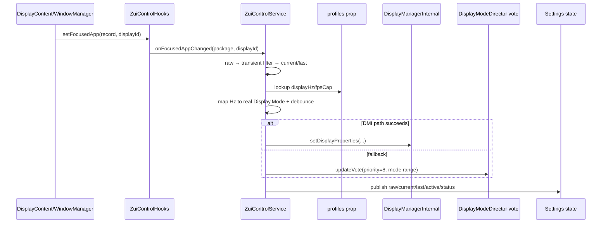
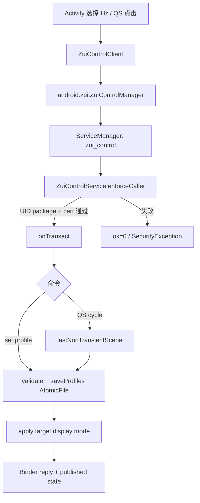
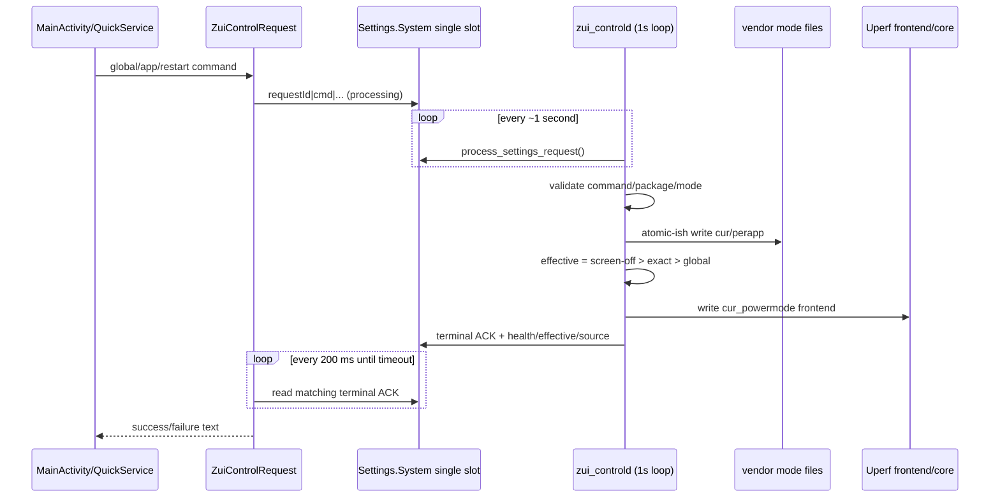
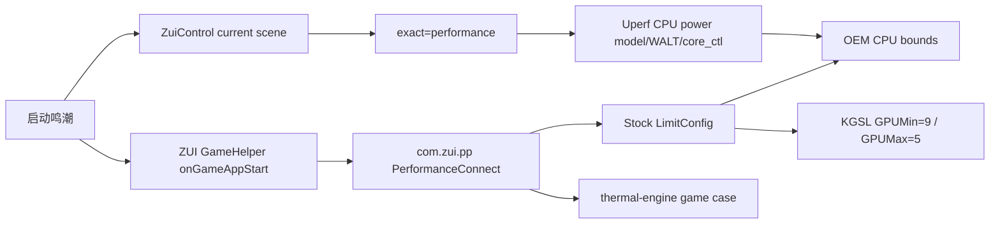

# 核心调用关系

## P0：焦点场景到刷新率



代码：`ZuiControlHooks.onFocusedAppChanged()` → `ZuiControlService.onFocusedAppChanged()/resolveSceneLocked()/applyTargetLocked()/publishState()`。失败结果保存在 `mLastError` 并通过 `state()` 返回；但 `publishState()` 自身失败会静默。

## P0：App/QS 到刷新率 profile



客户端 `ZuiControlClient.call()` 当前把 `ok=0` 误判为成功，返回链的展示语义有缺陷，但服务端鉴权仍执行。

## P0：Uperf 请求、优先级和即时性



实测：有效变化约 0.97–2.07 秒。若鸣潮有 exact `performance`，修改 global `fast` 不改变鸣潮有效档；修改鸣潮 exact 才改变。

## P0：真实游戏性能链冲突



结果不是单一策略：Uperf 与 OEM 同时进入 CPU 路径，GPU 仍由 OEM 约束。`uperf-sm8650.json` 无 KGSL 模块，因此无法从 Uperf 四档解释 500–629 MHz。

## P0：asoulOpt 内置启动

```mermaid
flowchart TD
  I[Android init] --> P[zui_scheduler_prepare.sh]
  P --> D[/data/vendor/zui_control/asoul/asopt.conf]
  P --> L[/data/vendor/asopt.conf symlink]
  I --> A[/system/bin/AsoulOpt]
  L --> A
  A --> T[embedded package/thread table]
  T --> S[affinity / WALT per-task boost]
  Z[zui_controld health every ~20s] --> A
  Z -->|missing| C[ctl.start zui_asoulopt]
```

外部 conf 提供 `mode=0/rt=0/opt`，不提供任意新包/线程规则。新游戏扩展受闭源内嵌表限制。

## 日志导出

`MainActivity.exportLogs()` → `ZuiControlRequest(CMD_EXPORT_LOGS)` → Settings request → `zui_controld.process_settings_request()` → 汇总 `/data/vendor/zui_control/log`/状态 → 写 `zui_control_log_export` → App 分享。原始设备 dump 不进入本审查源码包。
